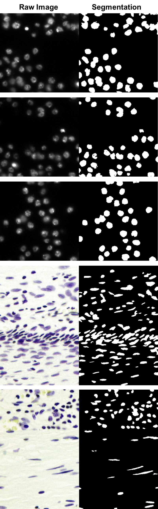

# Unet-Semantic-Segmentation
This repository contains an implementation of applying Unet to image semantic segmentation. 

# Unet
U-net architecture can be illustrated as below: 


(Image is cited from: Olaf Ronneberger, Philipp Fischer, Thomas Brox, "U-Net: Convolutional Networks for Biomedical Image Segmentation",Medical Image Computing and Computer-Assisted Intervention (MICCAI), Springer, LNCS, Vol.9351: 234--241, 2015
)

# Train
Run: 
```
main.py --use_gpu --optimizer sgd --unet_channels 32 --unet_batch_norm --learning_rate 0.01 --save_model_every 500
```
to train the model on training set. 

- [`--use_gpu`](appconf.html#usegpu)              - enable GPU of training
- [`--optimizer sgd`](appconf.html#optimizer)     - choice of different optimizer -sgd, -adam
- [`--unet_channels 32`](appconf.html#channels)   - number of channels in each layer, 32/64
- [`--unet_batch_norm`](appconf.html#batchnorm)   - utilization of batch normalization
- [`--learning_rate 0.01`](appconf.html#learningrate) - learning rate of back propagation
- [`--saved_model_every 500`](appconf.html#savemodel) - save model every 500 models (non-overwriting)


The model is saved every 500 iterations. Make sure to load the latest model when make prediction on test images.  

The training/validation images need to be updated under data/train. 


# Predict

After training on training image sets, the model can make predictions on the testing data. 
The test images need to be updated under data/test

Run 
```
main.py --predict --load_model --initial_checkpoint your_model_name --out_dir prediction_loc 
```
to predict testing data with trained model. 
- [`--predict`](appconf.html#predict) - enable prediction on loaded model
- [`--load_model`](appconf.html#load_model) - load existing model as initial checkpoint or for prediction
- [`--initial_checkpoint`](appconf.html#initialcheckpoint) - model name
- [`--initial_checkpoint`](appconf.html#outdir) - prediction saving directory

Examples of applying a well-trained model on testing images: 



